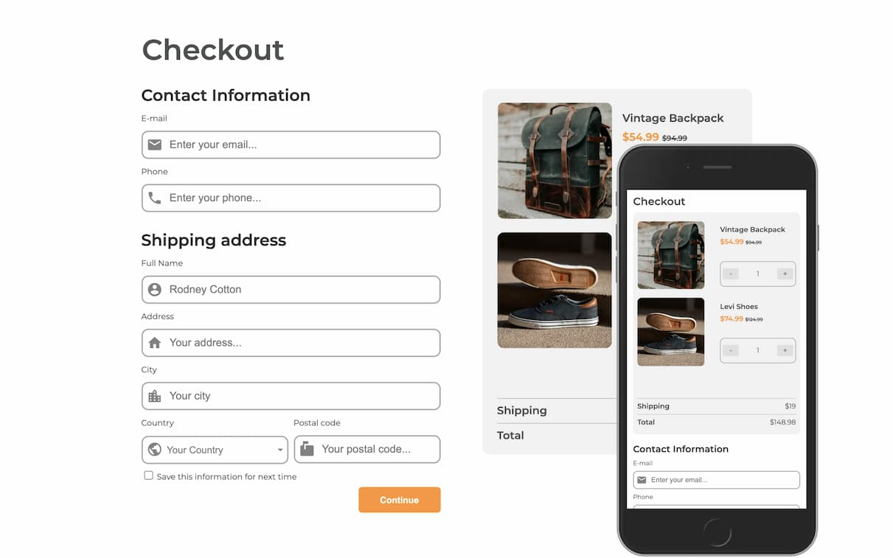

<!-- Please update value in the {}  -->

<h1 align="center">Checkout Page</h1>
<div align="center">
   Solution for a challenge from  <a href="http://devchallenges.io" target="_blank">Devchallenges.io</a>.
</div>
<div align="center">
  <h3>
    <a href="https://alexbaezd.github.io/checkout-page/">
      Demo
    </a>
    <span> | </span>
    <a href="https://github.com/alexbaezd/checkout-page">
      Solution
    </a>
    <span> | </span>
    <a href="https://devchallenges.io/challenges/0J1NxxGhOUYVqihwegfO">
      Challenge
    </a>
  </h3>
</div>

<!-- TABLE OF CONTENTS -->

## Table of Contents

- [Overview](#overview)
  - [Built With](#built-with)
- [Features](#features)
- [Contact](#contact)
- [Acknowledgements](#acknowledgements)

<!-- OVERVIEW -->

## Overview



### Built With

- HTML
- CSS
  - CSS Grid
    -Bootstrap
- JavaScript

## Features

This application/site was created as a submission to a [DevChallenges](https://devchallenges.io/challenges) challenge. The [challenge](https://devchallenges.io/challenges/0J1NxxGhOUYVqihwegfO) was to build an application to complete the given user stories.

- [x] User story: I can see a page following the given design
- [x] User story: I can input email, phone, full name, address, city, country, and postal code
- [x] User story: I can input the number of items
- [x] User story: I can select at least 3 countries from the dropdown
- [x] User story: When I click submit button or press enter, I can see a warning if validation fails
- [x] User story: When I click submit button or press enter, I can see a successful alert if validation succeeds

## How To Use

To clone and run this application, you'll need [Git](https://git-scm.com). From your command line:

```bash
# Clone this repository
$ git clone https://github.com/alexbaezd/checkout-page.git

$ cd recipe-page

# Open index.html on the browser
```

## Acknowledgements

- [Client-side form validation](https://developer.mozilla.org/en-US/docs/Learn/Forms/Form_validation)
- [:nth-child()](https://developer.mozilla.org/en-US/docs/Web/CSS/:nth-child)
- [JavaScript Client-side Form Validation](https://www.youtube.com/watch?v=rsd4FNGTRBw)
- [bootstrap-select](https://developer.snapappointments.com/bootstrap-select/)

## Contact

- Website [alexbaez.dev](https://alexbaez.dev)
- GitHub [@alexbaezd](https://github.com/alexbaezd)
